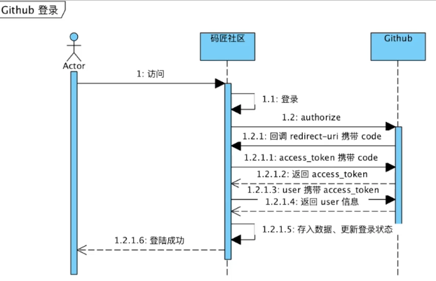

仙女的社区  
====
资料  
---
[Spring](https://spring.io/guides/gs/serving-web-content/#initial)  
[Bootstrap](https://www.bootcss.com)  
[Github key](https://github.com/yubaobao7646/community/settings/keys)  
[Github OAuth](https://docs.github.com/en/developers/apps/building-oauth-apps)  
Github授权登陆流程：  
[OKHttp](https://square.github.io/okhttp/)  
[SpringBoot dev tool](https://docs.spring.io/spring-boot/docs/2.0.0.RC1/reference/htmlsingle/#using-boot-devtools)

工具 
---
[Git](https://git-scm.com/downloads)  
[H2 database](http://www.h2database.com/html/main.html)
